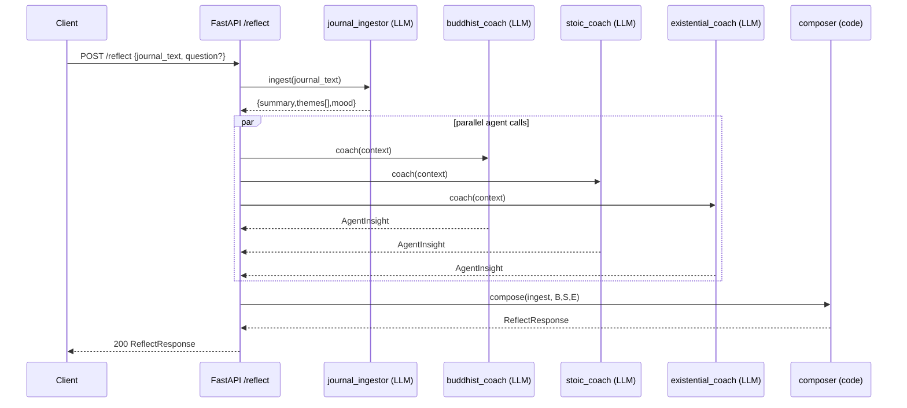

# Agentic AI Journal Reflection System — **Implementation Specification (MVP, Stateless)**

## 0) Summary

* **Stack:** FastAPI + OpenAI Agents SDK (model-agnostic).
* **Pattern:** App-orchestrated **fan-out + merge** (deterministic).
* **State:** **Stateless** (no memory, no RAG).
* **Feature flags:** Pluggable LLM Orchestrator to replace/augment the code-based composer later.

---

## 1) Goals & Non-Goals

**Goals**

* Ingest a single journal entry (Markdown/plain text, \~300–1000 words).
* Produce: concise summary, themes (≤5), mood (single label), and a final set of **actionable reflection prompts** + brief advice grounded in Buddhism, Stoicism, and Existentialism.
* Deterministic, testable orchestration and merge.

**Non-Goals (MVP)**

* No persistent memory or cross-session recall.
* No retrieval-augmented generation (RAG).
* No proactive pings/notifications.
* No citations to primary texts.

---

## 2) Public API

### Endpoint

`POST /reflect`

### Request (JSON)

```json
{
  "journal_text": "string, required",
  "question": "string, optional" 
}
```

### Response (JSON)

```json
{
  "summary": "string (<=120 words)",
  "themes": ["string", "..."], 
  "mood": "calm|tense|stressed|sad|angry|energized|mixed",
  "prompts": [
    {
      "text": "actionable reflection prompt",
      "source": "buddhist|stoic|existential",
      "rationale": "short why"
    }
  ],
  "advice": "brief, concrete guidance (<=120 words)",
  "warnings": ["string (optional)"],
  "trace_id": "uuid"
}
```

HTTP codes:

* **200** success, **400** validation error, **408/504** timeout, **502/503** upstream error, **500** unhandled.

---

## 3) Internal Components

### 3.1 Agents (OpenAI Agents SDK)

* **journal\_ingestor**

  * **Instruction:** Extract `{summary, themes[], mood}` only; no advice.
  * **Output schema (enforced):**

    ```json
    { "summary": "string<=120w", "themes": ["string<=5"], "mood": "enum" }
    ```
* **buddhist\_coach**, **stoic\_coach**, **existential\_coach**

  * **Instruction:** Given `{summary, themes, mood, question?}`, return **practical** insights and **actionable** prompt suggestions. Avoid metaphysics; keep grounded.
  * **Output schema:**

    ```json
    {
      "insights": ["string<=3"],
      "prompt_suggestions": ["string<=3"],
      "caveats": ["string (optional)"]
    }
    ```

*(Optional later: `philosophy_scout` — off by default.)*

### 3.2 Orchestrator (Code)

* Validates input; attaches `trace_id`.
* Calls **journal\_ingestor**.
* **Parallel** calls to 3 philosophy agents with ingestor output as context.
* Calls **composer** (code) to produce final response.
* Formats and returns API JSON.

### 3.3 Composer (Code, Deterministic)

* Inputs: 3 agent payloads + ingestor output.
* Steps:

  1. Collect all `prompt_suggestions` with `(text, source, rationale)`.
  2. **Deduplicate**: casefold, strip punctuation; Jaccard over token sets; drop near-duplicates.
  3. **Prioritize**:

     * Relevance: overlap with `themes` (simple keyword match).
     * Balance: ensure ≥1 and ≤2 from the most relevant agent; max **5** total prompts.
     * Actionability: prefer starts with a verb; reject vague prompts.
  4. Build `advice`: 2–4 sentences, concrete. If `question` present, answer it first.
  5. If any agent failed → add a `warnings[]` entry.
* Output: conforms to Public API schema above.

---

## 4) Config & Feature Flags

* `MODELS.INGESTOR` (e.g., a single general model initially).
* `MODELS.COACH` (same or separate).
* `FEATURES.LLM_ORCHESTRATOR` (**off** by default).
* `LIMITS.MAX_PROMPTS = 5`, `LIMITS.AGENT_TIMEOUT_SEC = 8`, `LIMITS.GLOBAL_TIMEOUT_SEC = 25`.
* `LOGGING.REDACT_INPUTS` (on by default; logs hashes and metadata only).

---

## 5) Error Handling & Timeouts

* **Per-agent timeout** (e.g., 8s). On timeout/error: skip that agent, record `warnings[]`.
* **Global timeout** (e.g., 25s) for the whole request.
* **Retries**: single retry with jitter for 5xx from model API.
* **Validation**: return 400 if `journal_text` empty or > \~10k chars (prevents token blow-ups).
* **Graceful degradation**: If ingestor fails → return 502 with a clear message; no downstream calls.

---

## 6) Observability

* **Tracing:** Generate `trace_id`; include in response; propagate to all agent calls.
* **Metrics:** latency (p50/p90), token usage per agent, error/timeout counts, dedupe rate.
* **Logs (redacted):** agent names, model ids, prompt hashes (SHA-256), output lengths, decision notes from composer (e.g., “dropped duplicate from stoic\_coach”).

---

## 7) Security (MVP)

* Local-only deployment acceptable; if remote, enforce HTTPS.
* No storage of raw journal text in logs.
* No PII scrubbing beyond basic redaction (MVP).
* Rate limit per IP (simple middleware).

---

## 8) Performance Targets (MVP)

* p50 latency ≤ 5–7s; p95 ≤ 15–20s (depends on models and parallelism).
* Availability target: 99% during testing periods.
* Cost guardrail: configurable max tokens per call; truncate inputs > context limit with a compacting step (strip quotes, code blocks, boilerplate).

---

## 9) Data Contracts (Pydantic Sketch)

```python
from pydantic import BaseModel, Field
from typing import List, Optional, Literal
import uuid

Mood = Literal["calm","tense","stressed","sad","angry","energized","mixed"]

class ReflectRequest(BaseModel):
    journal_text: str
    question: Optional[str] = None

class IngestResult(BaseModel):
    summary: str = Field(max_length=1000)  # ~120 words
    themes: List[str] = Field(max_items=5)
    mood: Mood

class AgentInsight(BaseModel):
    insights: List[str] = Field(max_items=3)
    prompt_suggestions: List[str] = Field(max_items=3)
    caveats: Optional[List[str]] = None

class PromptItem(BaseModel):
    text: str
    source: Literal["buddhist","stoic","existential"]
    rationale: str

class ReflectResponse(BaseModel):
    summary: str
    themes: List[str]
    mood: Mood
    prompts: List[PromptItem]
    advice: str
    warnings: Optional[List[str]] = None
    trace_id: str
```

---

## 10) Request Flow (Sequence)



---

## 11) Orchestration (FastAPI, High-Level)

* **Endpoint:** async handler; validate; create `trace_id`.
* **Call ingestor:** await; on error → 502.
* **`asyncio.gather`** the three coach calls with per-task timeout.
* **Composer:** run deterministic merge; generate final JSON.
* **Return:** `ReflectResponse`.

---

## 12) Composer Logic (High-Level Rules)

* **Deduping:**

  * Normalize: lowercase, strip punctuation, collapse whitespace.
  * Tokenize; compute Jaccard similarity; drop if ≥ 0.7 vs kept set.
* **Prioritization:**

  * Score each prompt: `theme_overlap_count + mood_alignment_bonus`.
  * Keep top prompts with **diversity constraint** (max 2 per source).
  * Cap total at **5**.
* **Advice:**

  * 2–4 sentences. If `question` present, address it first.
  * Include 1 concrete step (e.g., “Set a 10-min timer and …”).
* **Output:** fill schema; attach `warnings` if any agent failed.

---

## 13) Feature-Flagged LLM Orchestrator (Future Swap)

* Interface parity: accepts the same inputs (ingestor + agent outputs) and returns `ReflectResponse`.
* **Flag:** `FEATURES.LLM_ORCHESTRATOR=true` routes to an LLM-based composer **with hard constraints**:

  * Temperature low (e.g., 0.2), strict JSON schema, depth=1 tool calls, 10s timeout.
  * Must tag each prompt with `source`.
* **Circuit breaker:** on error/timeout → fallback to code composer.

---

## 14) Testing & Evaluation

* **Unit tests:** schema validation, dedupe edge cases, prioritization logic, timeouts, failure of one agent.
* **Golden set:** 10–20 sample journals with expected #prompts, balance, and tone checks.
* **Load test:** 50–100 concurrent requests to validate latency with parallel agent calls.
* **Telemetry review:** confirm dedupe rate, prompt balance, and tail latencies weekly.

---

## 15) Deployment

* Containerized FastAPI app; gunicorn/uvicorn workers with async loop.
* Env-configured model settings and flags.
* CI to run unit tests + schema checks; CD to staging/prod.
* Optional: simple API key auth for the endpoint in MVP.

---

## 16) Rollout Plan

1. **Dev:** single model for all agents, deterministic composer, logging redacted.
2. **Beta:** add cheaper model for ingestor (feature flag).
3. **Experiment:** enable LLM Orchestrator flag for a subset; compare via logs/UX rubric.
4. **Iterate:** adjust schemas and composer rules based on feedback.

---

If you want, I can turn this into a small repo scaffold outline (folders, config, and placeholder prompt files) to hand to Claude Code.
