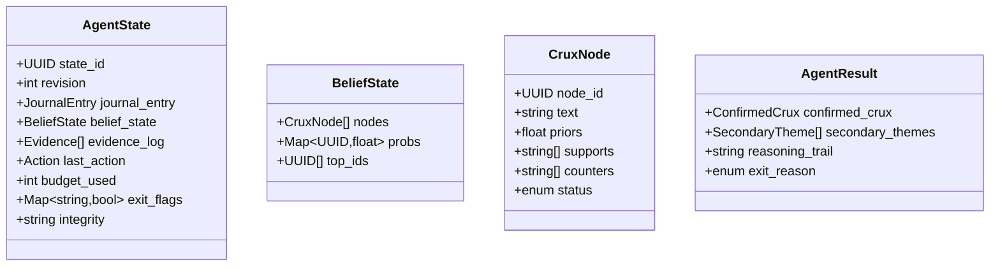
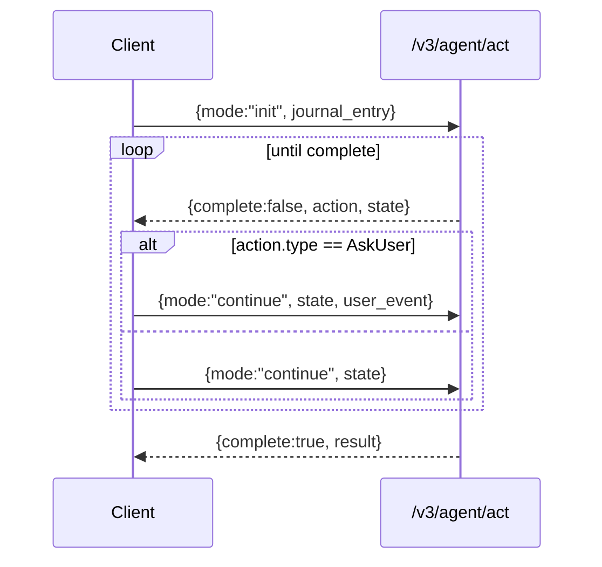

# System Data Flow — v3 (FACD) and Coexisting v2 Paths

This document contains **Mermaid** diagrams you can paste into your docs (GitHub, Notion with Mermaid plugin, Docusaurus, etc.). ASCII fallbacks are included beneath each diagram.

---

## 1) Context & High-Level Data Flow (v3 + v2 coexistence)

```mermaid
flowchart LR
  subgraph Client["Client Apps"]
    U[User]
    W[Web/iOS Client]
  end

  subgraph API["Server API Layer"]
    A3["POST /v3/agent/act"]
    A2["POST /v2/reflections"]
    A1["POST /reflections"]
    AX["POST /excavations (unchanged)"]
  end

  subgraph FACD["FACD Engine (Agentic Loop)"]
    SB[SeedBeliefs]
    AG[Action Generator]
    EV[EVI - λ·Cost Scorer]
    EX[Action Executor]
    BU[Belief Updater]
    ST[(AgentState<br/>(stateless, round-tripped))]
  end

  subgraph Observability["Observability"]
    M[Metrics]
    L[Logs & Traces]
  end

  subgraph Safety["Guardrails"]
    DG[Distress Gate]
    CR[Crisis Resources Payload]
  end

  subgraph Reflection["Reflection Service"]
    R2[Perspectives + Oracle]
  end

  U -->|Journal entry text| W
  W -->|init/continue| A3
  A3 --> SB --> AG --> EV --> EX --> BU --> ST
  ST --> A3

  EX -->|AskUser action| W
  W -->|user_event(answer)| A3

  A3 -->|complete + handoff_payload| R2
  R2 -->|Reflection| W

  %% v2 one-shot path
  W -->|entry| A1 --> R2 --> W

  %% /v2/reflections path (unchanged)
  W -->|completed excavation payload| A2 --> R2 --> W

  %% /excavations (unchanged; no current clients)
  W -. optional .-> AX

  %% telemetry & safety
  FACD --> M
  FACD --> L
  EX --> DG
  DG -->|if triggered| CR --> W
```

**ASCII (fallback)**

Client → **/v3/agent/act** → FACD Engine {SeedBeliefs → ActionGenerator → EVI Scorer → ActionExecutor → BeliefUpdater} → AgentState (round-tripped)
↳ If `AskUser`: Server → Client (question) → Client → Server (user_event)
↳ On complete: FACD → Reflection Service (Perspectives/Oracle) → Client (Reflection)

Also:
- One-shot: Client → **/reflections** → Reflection → Client
- v2-compatible: Client → **/v2/reflections** → Reflection → Client
- **/excavations** remains unchanged (no current clients)

---

## 2) FACD Agentic Turn — Sequence Diagram

```mermaid
sequenceDiagram
  participant User
  participant Client
  participant API as /v3/agent/act
  participant FACD as FACD Engine
  participant Obs as Observability
  participant Safe as Guardrails
  participant Refl as Reflection Service

  User->>Client: Write journal entry
  Client->>API: mode=init, journal_entry
  API->>FACD: seed_beliefs(journal_entry)
  FACD->>FACD: enumerate_actions()
  FACD->>FACD: score = E[ΔH] - λ·Cost
  alt Best action is AskUser
    FACD-->>API: action=AskUser, state(revision=1)
    API-->>Client: AskUser(question, state)
    Client->>API: mode=continue, state, user_event(answer)
    API->>FACD: update_beliefs(answer)
    FACD->>FACD: should_stop()? (τ, δ, ε, budget)
  else Internal action
    FACD->>FACD: execute(action) -> evidence
    FACD->>FACD: update_beliefs(evidence)
  end
  FACD->>Obs: metrics/logs/traces
  FACD->>Safe: distress check
  opt Distress triggered
    Safe-->>Client: crisis resources payload
    note right of Client: Client renders crisis UI; normal flow stops
  end
  alt Completion
    FACD-->>API: complete=true, result(confirmed_crux, secondary_themes)
    API->>Refl: handoff_payload
    Refl-->>API: reflection
    API-->>Client: reflection
  else Continue
    FACD-->>API: next action, state(revision+1)
    API-->>Client: action, state
  end
```

**ASCII (fallback)**

1. Client → `/v3/agent/act` (init) with journal entry  
2. FACD: enumerate → score → choose action  
3. If AskUser: return question + state; client replies with `user_event` → update beliefs  
4. If internal: execute → evidence → update beliefs  
5. Check stop conditions (τ, δ, ε, budgets)  
6. If complete: hand off to Reflection → return Reflection to client; else return next action + state

---

## 3) Data Lifecycle & Storage Boundaries

```mermaid
flowchart TB
  JE[Journal Entry (plaintext in request)]
  ST[(AgentState<br/>JSON, signed optional HMAC)]
  EVL[(Evidence Log<br/>in state)]
  TM[(Metrics)]
  LG[(Traces/Logs)]
  REF[Reflection Output]
  CR[(Crisis Resources Payload)]

  JE --> ST
  ST -->|round-tripped| ST
  ST --> EVL
  EVL --> ST

  ST -->|on completion| REF
  REF -->|to client| REF

  ST --> TM
  ST --> LG

  ST -->|guardrail| CR -->|to client| CR

  subgraph Boundaries
    direction LR
    C1[Client: stores/forwards state] --- S1[Server: stateless between calls]
  end
```

**Key Points**
- **Stateless server**: no DB persistence of AgentState in v3; the **client round-trips** `state`.  
- **Evidence** is embedded in state (for reasoning trail); not stored server-side.  
- **Metrics/Logs** are emitted per turn; redact or hash sensitive text as required.  
- **Reflection output** is generated server-side and returned to the client.  
- **Crisis payload** is returned immediately if guardrails trigger.

---

## 4) Data Shapes (At a Glance)



**Note:** Full JSON/OpenAPI is defined in `v3-implementation-specifications.md`.

---

## 5) Minimal Client Loop



**ASCII (fallback)**

`init` → receive `action/state` → `continue` (with or without `user_event`) → repeat → receive `result`.

---